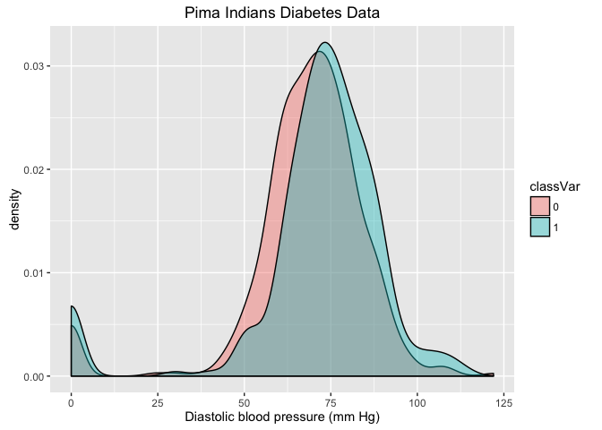
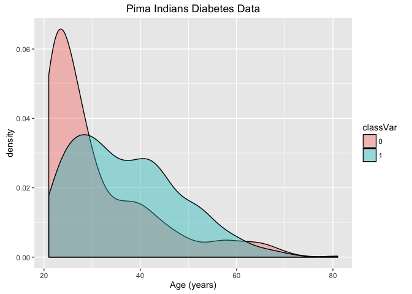
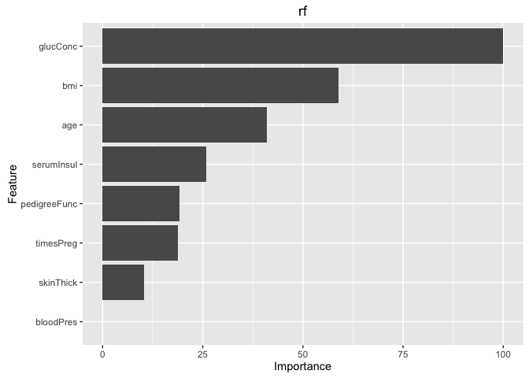

Case Study in Addressing Missing Values: Pima Indians Diabetes Data
================
Ben Fauber
November 14, 2016

### Diabetes

<A HREF="https://en.wikipedia.org/wiki/Diabetes_mellitus">Diabetes mellitus</A> is a metabolic disease that impacts the body's ability to normalize blood sugar levels. Diabetes is due to either the pancreas not producing enough insulin or the cells of the body not responding properly to the insulin produced. If left untreated, diabetes can cause many complications such as heart disease, stroke, chronic kidney failure, foot ulcers, damage to the eyes, or death.

Diabetes is characterized by recurrent or persistent high blood sugar. It is typically diagnosed by demonstrating plasma glucose ≥ 11.1 mmol/L (200 mg/dL) two hours after a 75 g oral glucose load as in a glucose tolerance test.

### Pima Indians Diabetes Data Set

The Pima Indians Diabetes data set is a publicly available data set from the University of California at Irvine Machine Learning database: <https://archive.ics.uci.edu/ml/datasets/Pima+Indians+Diabetes>

Several college upper-level statistics courses make use of this data set to teach modeling approaches, and the data set also is a topic of frequent discussion on the data science website <A HREF="https://www.kaggle.com/uciml/pima-indians-diabetes-database">Kaggle</A>.

Rather than borrowing from the existing code and kernels on Kaggle, I chose to build my R script from scratch, showcasing my approach in addressing with the missing data values (&gt;50% incomplete rows). Specifically, I chose to utilize a multiple imputation technique to facitiate the construction of the machine learning models.

##### Data Set Information

Several constraints were placed on the selection of these instances from a larger database. In particular, all patients here are females at least 21 years old of Pima Indian heritage.

Attribute Information:

1.  Number of times pregnant
2.  Plasma glucose concentration at 2 hours in an oral glucose tolerance test (mM)
3.  Diastolic blood pressure (mm Hg)
4.  Triceps skin fold thickness (mm)
5.  2-Hour serum insulin (mu U/mL)
6.  Body mass index (weight in kg/(height in m)^2)
7.  Diabetes pedigree function
8.  Age (years)
9.  Class variable (0 or 1), 0=negative for diabetes, 1=positive

### Goal

Identify a robust and general data model to accurately classify current (and potential patients) into bins of negative or positive for diabetes (Class variable, column 9 in data set) based on known risk factors (other data in the data set).

Optimize and select an appropriate model using training data. Use cross-validation to avoid overfitting the training data. Validate the model using hold-out data and identify the optimal model and parameters.

### Loading and Visualizing the Data

``` r
library(C50)
library(caret)
```

    ## Loading required package: lattice

    ## Loading required package: ggplot2

``` r
library(e1071)
library(ggplot2)
library(kernlab)
```

    ## 
    ## Attaching package: 'kernlab'

    ## The following object is masked from 'package:ggplot2':
    ## 
    ##     alpha

``` r
library(mice)
```

    ## Loading required package: Rcpp

    ## mice 2.25 2015-11-09

``` r
library(plyr)
library(randomForest)
```

    ## randomForest 4.6-12

    ## Type rfNews() to see new features/changes/bug fixes.

    ## 
    ## Attaching package: 'randomForest'

    ## The following object is masked from 'package:ggplot2':
    ## 
    ##     margin

``` r
library(VIM)
```

    ## Loading required package: colorspace

    ## Loading required package: grid

    ## Loading required package: data.table

    ## VIM is ready to use. 
    ##  Since version 4.0.0 the GUI is in its own package VIMGUI.
    ## 
    ##           Please use the package to use the new (and old) GUI.

    ## Suggestions and bug-reports can be submitted at: https://github.com/alexkowa/VIM/issues

    ## 
    ## Attaching package: 'VIM'

    ## The following object is masked from 'package:datasets':
    ## 
    ##     sleep

``` r
pima <- read.table("~/Desktop/PimaIndianDiabetesData/MAIN_pima-indians-diabetes.data", sep = ",", na.strings="0.0", strip.white=TRUE, fill=TRUE)
```

#### Assign column headers

``` r
names(pima) <- c("timesPreg", "glucConc", "bloodPres", "skinThick", "serumInsul", "bmi", "pedigreeFunc", "age", "classVar")
```

#### Understanding the data using summary stats

``` r
str(pima)
```

    ## 'data.frame':    768 obs. of  9 variables:
    ##  $ timesPreg   : int  6 1 8 1 0 5 3 10 2 8 ...
    ##  $ glucConc    : int  148 85 183 89 137 116 78 115 197 125 ...
    ##  $ bloodPres   : int  72 66 64 66 40 74 50 0 70 96 ...
    ##  $ skinThick   : int  35 29 0 23 35 0 32 0 45 0 ...
    ##  $ serumInsul  : int  0 0 0 94 168 0 88 0 543 0 ...
    ##  $ bmi         : num  33.6 26.6 23.3 28.1 43.1 25.6 31 35.3 30.5 NA ...
    ##  $ pedigreeFunc: num  0.627 0.351 0.672 0.167 2.288 ...
    ##  $ age         : int  50 31 32 21 33 30 26 29 53 54 ...
    ##  $ classVar    : int  1 0 1 0 1 0 1 0 1 1 ...

``` r
summary(pima)
```

    ##    timesPreg         glucConc       bloodPres        skinThick    
    ##  Min.   : 0.000   Min.   :  0.0   Min.   :  0.00   Min.   : 0.00  
    ##  1st Qu.: 1.000   1st Qu.: 99.0   1st Qu.: 62.00   1st Qu.: 0.00  
    ##  Median : 3.000   Median :117.0   Median : 72.00   Median :23.00  
    ##  Mean   : 3.845   Mean   :120.9   Mean   : 69.11   Mean   :20.54  
    ##  3rd Qu.: 6.000   3rd Qu.:140.2   3rd Qu.: 80.00   3rd Qu.:32.00  
    ##  Max.   :17.000   Max.   :199.0   Max.   :122.00   Max.   :99.00  
    ##                                                                   
    ##    serumInsul         bmi         pedigreeFunc         age       
    ##  Min.   :  0.0   Min.   :18.20   Min.   :0.0780   Min.   :21.00  
    ##  1st Qu.:  0.0   1st Qu.:27.50   1st Qu.:0.2437   1st Qu.:24.00  
    ##  Median : 30.5   Median :32.30   Median :0.3725   Median :29.00  
    ##  Mean   : 79.8   Mean   :32.46   Mean   :0.4719   Mean   :33.24  
    ##  3rd Qu.:127.2   3rd Qu.:36.60   3rd Qu.:0.6262   3rd Qu.:41.00  
    ##  Max.   :846.0   Max.   :67.10   Max.   :2.4200   Max.   :81.00  
    ##                  NA's   :11                                      
    ##     classVar    
    ##  Min.   :0.000  
    ##  1st Qu.:0.000  
    ##  Median :0.000  
    ##  Mean   :0.349  
    ##  3rd Qu.:1.000  
    ##  Max.   :1.000  
    ## 

bmi has 11 NA's

Strong skew on serumInsul due to high-end outliers

``` r
table(pima$timesPreg)
```

    ## 
    ##   0   1   2   3   4   5   6   7   8   9  10  11  12  13  14  15  17 
    ## 111 135 103  75  68  57  50  45  38  28  24  11   9  10   2   1   1

timesPreg peaks around 1 time, max= 17 times (n=1)

``` r
table(pima$classVar)
```

    ## 
    ##   0   1 
    ## 500 268

35% are Class 1

``` r
pimaSub1 <- subset(pima, (
    pima$glucConc > 0 & pima$bloodPres > 0 &
    pima$skinThick > 0 & pima$serumInsul > 0 &
    pima$bmi > 0 & pima$pedigreeFunc > 0 &
    pima$age > 0))
```

n=392 (51%)

### Using CARET to examine co-linearity in pimaSub1 data

#### convert data.frame to numeric format for analysis

``` r
for(i in c(1:ncol(pimaSub1))) 
{
    pimaSub1[,i] <- as.numeric(as.character(pimaSub1[,i]))
}

pimaSub1.cor <- round(cor(pimaSub1), 2)

print(pimaSub1.cor)
```

    ##              timesPreg glucConc bloodPres skinThick serumInsul   bmi
    ## timesPreg         1.00     0.20      0.21      0.09       0.08 -0.03
    ## glucConc          0.20     1.00      0.21      0.20       0.58  0.21
    ## bloodPres         0.21     0.21      1.00      0.23       0.10  0.30
    ## skinThick         0.09     0.20      0.23      1.00       0.18  0.66
    ## serumInsul        0.08     0.58      0.10      0.18       1.00  0.23
    ## bmi              -0.03     0.21      0.30      0.66       0.23  1.00
    ## pedigreeFunc      0.01     0.14     -0.02      0.16       0.14  0.16
    ## age               0.68     0.34      0.30      0.17       0.22  0.07
    ## classVar          0.26     0.52      0.19      0.26       0.30  0.27
    ##              pedigreeFunc  age classVar
    ## timesPreg            0.01 0.68     0.26
    ## glucConc             0.14 0.34     0.52
    ## bloodPres           -0.02 0.30     0.19
    ## skinThick            0.16 0.17     0.26
    ## serumInsul           0.14 0.22     0.30
    ## bmi                  0.16 0.07     0.27
    ## pedigreeFunc         1.00 0.09     0.21
    ## age                  0.09 1.00     0.35
    ## classVar             0.21 0.35     1.00

Strongest correlation: r = 0.68, age to timesPreg

Also: r = 0.66, bmi to skinThick

Strongest meaningful correlation (r = 0.58), glucConc to serumInsul

GlucConc has the strongest correation (r = 0.52) to classVar

Age is \#2 with r = 0.35 to classVar

#### Revisit the strongest correlations with plots.

Density distribution plots, segmented by classVar



    ## Warning: Removed 11 rows containing non-finite values (stat_density).



Density plot of classVar


Histogram of timesPreg


Futher examining the cor identified in the above section, using the pimaSub1 data


Visualizing the relationship of other pimaSub1 variables to classVar


### Cleaning the Data

``` r
summary(pima)
```

    ##    timesPreg         glucConc       bloodPres        skinThick    
    ##  Min.   : 0.000   Min.   :  0.0   Min.   :  0.00   Min.   : 0.00  
    ##  1st Qu.: 1.000   1st Qu.: 99.0   1st Qu.: 62.00   1st Qu.: 0.00  
    ##  Median : 3.000   Median :117.0   Median : 72.00   Median :23.00  
    ##  Mean   : 3.845   Mean   :120.9   Mean   : 69.11   Mean   :20.54  
    ##  3rd Qu.: 6.000   3rd Qu.:140.2   3rd Qu.: 80.00   3rd Qu.:32.00  
    ##  Max.   :17.000   Max.   :199.0   Max.   :122.00   Max.   :99.00  
    ##                                                                   
    ##    serumInsul         bmi         pedigreeFunc         age        classVar
    ##  Min.   :  0.0   Min.   :18.20   Min.   :0.0780   Min.   :21.00   0:500   
    ##  1st Qu.:  0.0   1st Qu.:27.50   1st Qu.:0.2437   1st Qu.:24.00   1:268   
    ##  Median : 30.5   Median :32.30   Median :0.3725   Median :29.00           
    ##  Mean   : 79.8   Mean   :32.46   Mean   :0.4719   Mean   :33.24           
    ##  3rd Qu.:127.2   3rd Qu.:36.60   3rd Qu.:0.6262   3rd Qu.:41.00           
    ##  Max.   :846.0   Max.   :67.10   Max.   :2.4200   Max.   :81.00           
    ##                  NA's   :11

All values are finite, some NA values present in bmi

Omit all unique identifiers in model data: None found in data, pass

``` r
p <- pima
```

Notes with raw data indicated that all but timesPreg and ClassVar cols zero values == NA

Addressing the NA and zero values in all but timesPreg and classVar cols

``` r
p$glucConc[p$glucConc == 0] <- NA
p$bloodPres[p$bloodPres == 0] <- NA
p$skinThick[p$skinThick == 0] <- NA
p$serumInsul[p$serumInsul == 0] <- NA
p$bmi[p$bmi == 0] <- NA
p$pedigreeFunc[p$pedigreeFunc == 0] <- NA
p$age[p$age == 0] <- NA
```

List the rows that do not have missing values

``` r
pComp <- p[complete.cases(p), ]

nrow(pComp)
```

    ## [1] 392

392 complete case rows (out of 768, 51%)

List the rows that have one or more missing values:

``` r
pInc <- p[!complete.cases(p), ]

nrow(pInc)
```

    ## [1] 376

376 incomplete case rows (out of 768, 49%)

Significant percentage of rows are missing at least one value, thus cannot omit.

Rows that contain NA values in analysis without losing ~50% of data

#### Using MICE to understand missing data patterns

``` r
md.pattern(p)
```

    ##     timesPreg pedigreeFunc age classVar glucConc bmi bloodPres skinThick
    ## 392         1            1   1        1        1   1         1         1
    ##   1         1            1   1        1        0   1         1         1
    ## 140         1            1   1        1        1   1         1         1
    ##   1         1            1   1        1        1   0         1         1
    ##   4         1            1   1        1        0   1         1         1
    ##   2         1            1   1        1        1   1         0         1
    ## 192         1            1   1        1        1   1         1         0
    ##   1         1            1   1        1        1   0         1         1
    ##  26         1            1   1        1        1   1         0         0
    ##   2         1            1   1        1        1   0         1         0
    ##   7         1            1   1        1        1   0         0         0
    ##             0            0   0        0        5  11        35       227
    ##     serumInsul    
    ## 392          1   0
    ##   1          1   1
    ## 140          0   1
    ##   1          1   1
    ##   4          0   2
    ##   2          0   2
    ## 192          0   2
    ##   1          0   2
    ##  26          0   3
    ##   2          0   3
    ##   7          0   4
    ##            374 652

192 rows have all data except serumInsul and skinThick

140 rows have all data except serumInsul

26 rows have all data except serumInsul, skinThick, and bloodPres

7 rows have all data except serumInsul, skinThick, bloodPres, and bmi

4 rows have all data except glucConc and serumInsul

7 rows have all data exept a mixture of 1-3 columns

no NA's present for timesPreg, pedigreeFunc, age, and classVar

Thus, addressing the serumInsul NA values can address most of the missing data, followed by skinThic and bloodPress.

#### Create a shadow matrix of the NA values and explore NA cor

``` r
pS <- p

for(i in c(1:ncol(pS))) 
{
    pS[,i] <- as.numeric(as.character(pS[,i]))
}

pShadow <- as.data.frame(abs(is.na(pS)))

y <- pShadow[which(apply(pShadow, 2, sum) > 0)]

pShadow.cor <- cor(y)
```

r = 0.66 for NA cor of serumInsul and skinThick

r = 0.34 for NA cor of bmi and bloodPres

r = 0.31 for NA cor of skinThick and bloodPres

r = 0.22 for NA cor of serumInsul and bloodPres

All other r values &lt; 0.15

``` r
yy <- cor(pS, pShadow, use="pairwise.complete.obs")
```

Highest r values are 0.22 and 0.21 for age & skinThick and age & serumInsul.

Thus, it is most likely that the missing values are missing at random or missing at complete random.

Unable to revisit research team and investigate cause/rationale for missing data. Must address using imputed methods, will use MICE and VIM.

``` r
pImp <- mice(p, seed=123)
```

    ## 
    ##  iter imp variable
    ##   1   1  glucConc  bloodPres  skinThick  serumInsul  bmi
    ##   1   2  glucConc  bloodPres  skinThick  serumInsul  bmi
    ##   1   3  glucConc  bloodPres  skinThick  serumInsul  bmi
    ##   1   4  glucConc  bloodPres  skinThick  serumInsul  bmi
    ##   1   5  glucConc  bloodPres  skinThick  serumInsul  bmi
    ##   2   1  glucConc  bloodPres  skinThick  serumInsul  bmi
    ##   2   2  glucConc  bloodPres  skinThick  serumInsul  bmi
    ##   2   3  glucConc  bloodPres  skinThick  serumInsul  bmi
    ##   2   4  glucConc  bloodPres  skinThick  serumInsul  bmi
    ##   2   5  glucConc  bloodPres  skinThick  serumInsul  bmi
    ##   3   1  glucConc  bloodPres  skinThick  serumInsul  bmi
    ##   3   2  glucConc  bloodPres  skinThick  serumInsul  bmi
    ##   3   3  glucConc  bloodPres  skinThick  serumInsul  bmi
    ##   3   4  glucConc  bloodPres  skinThick  serumInsul  bmi
    ##   3   5  glucConc  bloodPres  skinThick  serumInsul  bmi
    ##   4   1  glucConc  bloodPres  skinThick  serumInsul  bmi
    ##   4   2  glucConc  bloodPres  skinThick  serumInsul  bmi
    ##   4   3  glucConc  bloodPres  skinThick  serumInsul  bmi
    ##   4   4  glucConc  bloodPres  skinThick  serumInsul  bmi
    ##   4   5  glucConc  bloodPres  skinThick  serumInsul  bmi
    ##   5   1  glucConc  bloodPres  skinThick  serumInsul  bmi
    ##   5   2  glucConc  bloodPres  skinThick  serumInsul  bmi
    ##   5   3  glucConc  bloodPres  skinThick  serumInsul  bmi
    ##   5   4  glucConc  bloodPres  skinThick  serumInsul  bmi
    ##   5   5  glucConc  bloodPres  skinThick  serumInsul  bmi

Address serumInsul as it is the largest contributor to NA values. Age and glucConc are have biggest cor to serumInsul, other parameters have some but lower cor.

``` r
pFit <- with(pImp, lm(serumInsul ~ age + glucConc + bmi + skinThick + bloodPres))

pPool <- pool(pFit)

summary(pPool)
```

    ##                      est         se          t         df     Pr(>|t|)
    ## (Intercept) -133.7473414 42.7728749 -3.1269196   7.974146 1.413774e-02
    ## age            0.5881093  0.7557190  0.7782117   5.543328 4.683465e-01
    ## glucConc       1.9829728  0.1690052 11.7332064  13.858977 1.390868e-08
    ## bmi            2.3300499  0.8505053  2.7396065  24.970359 1.118827e-02
    ## skinThick     -0.2893176  0.4634760 -0.6242343 130.153563 5.335664e-01
    ## bloodPres     -0.5930828  0.6890623 -0.8607100   5.773299 4.236951e-01
    ##                   lo 95      hi 95 nmis       fmi    lambda
    ## (Intercept) -232.437460 -35.057222   NA 0.7513421 0.6959257
    ## age           -1.298631   2.474850    0 0.8705151 0.8309375
    ## glucConc       1.620146   2.345799    5 0.5829207 0.5267823
    ## bmi            0.578296   4.081804   11 0.4329879 0.3893218
    ## skinThick     -1.206239   0.627604  227 0.1691729 0.1565034
    ## bloodPres     -2.295337   1.109172   35 0.8572472 0.8150956

``` r
pI <- complete(pImp, action=3)
```

Convert data.frame to numeric format for analysis

``` r
for(i in c(1:ncol(pI))) 
{
    pI[,i] <- as.numeric(as.character(pI[,i]))
}
```

Convert classVar values to meaningful factors

``` r
pI$classVar <- factor(pI$classVar)

levels(pI$classVar) <- c("negative", "positive")

table(pI$classVar)
```

    ## 
    ## negative positive 
    ##      500      268

500=negative, 268=positive

### Building the Training and Test (hold-out) data sets with CARET

Define an 70%/30% train/test split of the data set

``` r
set.seed(123)

pItemp <- createDataPartition(pI[,ncol(pI)], p = 0.7, list = FALSE)

pItrain <- pI[pItemp,]
pItest <- pI[-pItemp,]
```

Count of total values in each dataset

``` r
pItrainN <- nrow(pItrain)*ncol(pItrain)
pItestN <- nrow(pItest)*ncol(pItest)
```

### Establish 10-fold cross-validation parameter for training and tuning models

Minimize overfitting of the training data.

``` r
fitControl <- trainControl(method = "repeatedcv", number = 10, repeats = 10)
```

### Optimize classification models with CARET

#### Build a generalized linear model (GLM) for dichotomous response data

``` r
set.seed(123)

ptm <- proc.time()

pI1fit <- train(classVar ~., data=pItrain, metric="Accuracy", trControl=fitControl, method="glm", tuneLength=10, na.action=na.omit)

pI1fitT <- proc.time() - ptm
```

``` r
print(pI1fitT)
```

    ##    user  system elapsed 
    ##   2.125   0.024   2.207

List the predictor column names and summarize the model

``` r
predictors(pI1fit)
```

    ## [1] "timesPreg"    "glucConc"     "bloodPres"    "skinThick"   
    ## [5] "serumInsul"   "bmi"          "pedigreeFunc" "age"

``` r
print(pI1fit)
```

    ## Generalized Linear Model 
    ## 
    ## 538 samples
    ##   8 predictor
    ##   2 classes: 'negative', 'positive' 
    ## 
    ## No pre-processing
    ## Resampling: Cross-Validated (10 fold, repeated 10 times) 
    ## Summary of sample sizes: 485, 484, 484, 484, 484, 485, ... 
    ## Resampling results:
    ## 
    ##   Accuracy  Kappa    
    ##   0.777914  0.4905015
    ## 
    ## 

``` r
print(pI1fit$bestTune)
```

    ##   parameter
    ## 1      none


#### Build a c5.0 classification model

``` r
set.seed(123)

ptm <- proc.time()

pI2fit <- train(classVar ~., data=pItrain, metric="Accuracy", trControl=fitControl, method="C5.0", na.action=na.omit)

pI2fitT <- proc.time() - ptm
```

``` r
print(pI2fitT)
```

    ##    user  system elapsed 
    ##  24.175   0.185  24.591

List the predictor column names and summarize the model

``` r
predictors(pI2fit)
```

    ## [1] "bmi"          "glucConc"     "age"          "pedigreeFunc"
    ## [5] "timesPreg"    "serumInsul"   "skinThick"    "bloodPres"

``` r
print(pI2fit)
```

    ## C5.0 
    ## 
    ## 538 samples
    ##   8 predictor
    ##   2 classes: 'negative', 'positive' 
    ## 
    ## No pre-processing
    ## Resampling: Cross-Validated (10 fold, repeated 10 times) 
    ## Summary of sample sizes: 485, 484, 484, 484, 484, 485, ... 
    ## Resampling results across tuning parameters:
    ## 
    ##   model  winnow  trials  Accuracy   Kappa    
    ##   rules  FALSE    1      0.7420300  0.4288470
    ##   rules  FALSE   10      0.7599126  0.4605397
    ##   rules  FALSE   20      0.7591754  0.4619529
    ##   rules   TRUE    1      0.7377463  0.4113503
    ##   rules   TRUE   10      0.7584312  0.4530818
    ##   rules   TRUE   20      0.7584451  0.4538632
    ##   tree   FALSE    1      0.7404997  0.4275127
    ##   tree   FALSE   10      0.7571314  0.4580807
    ##   tree   FALSE   20      0.7589693  0.4656679
    ##   tree    TRUE    1      0.7377568  0.4148781
    ##   tree    TRUE   10      0.7580398  0.4530300
    ##   tree    TRUE   20      0.7584102  0.4549503
    ## 
    ## Accuracy was used to select the optimal model using  the largest value.
    ## The final values used for the model were trials = 10, model = rules
    ##  and winnow = FALSE.

``` r
print(pI2fit$bestTune)
```

    ##   trials model winnow
    ## 8     10 rules  FALSE


#### Build a RandomForest (RF) classification model

Optimize the mtry RF parameter.

Default mtry in RF is sqrt(ncol(training)). Bracket mtry parameters, start with grid min = sMt/2 and grid max = 2\*sMt

``` r
sMt <- round(sqrt(ncol(pItrain)), digits=0)

rfGrid3 <- expand.grid(.mtry = c(sMt/2, sMt, sMt*2))

set.seed(123)

ptm <- proc.time()

pI3fit <- train(classVar ~., data=pItrain, method="rf", metric="Accuracy", trControl=fitControl, ntree=500, tuneGrid=rfGrid3, importance=TRUE, 
na.action=na.omit)

pI3fitT <- proc.time() - ptm
```

``` r
print(pI3fitT)
```

    ##    user  system elapsed 
    ## 135.122   2.544 138.607

``` r
predictors(pI3fit)
```

    ## [1] "timesPreg"    "glucConc"     "bloodPres"    "skinThick"   
    ## [5] "serumInsul"   "bmi"          "pedigreeFunc" "age"

``` r
summary(pI3fit)
```

    ##                 Length Class      Mode     
    ## call               6   -none-     call     
    ## type               1   -none-     character
    ## predicted        538   factor     numeric  
    ## err.rate        1500   -none-     numeric  
    ## confusion          6   -none-     numeric  
    ## votes           1076   matrix     numeric  
    ## oob.times        538   -none-     numeric  
    ## classes            2   -none-     character
    ## importance        32   -none-     numeric  
    ## importanceSD      24   -none-     numeric  
    ## localImportance    0   -none-     NULL     
    ## proximity          0   -none-     NULL     
    ## ntree              1   -none-     numeric  
    ## mtry               1   -none-     numeric  
    ## forest            14   -none-     list     
    ## y                538   factor     numeric  
    ## test               0   -none-     NULL     
    ## inbag              0   -none-     NULL     
    ## xNames             8   -none-     character
    ## problemType        1   -none-     character
    ## tuneValue          1   data.frame list     
    ## obsLevels          2   -none-     character

``` r
print(pI3fit)
```

    ## Random Forest 
    ## 
    ## 538 samples
    ##   8 predictor
    ##   2 classes: 'negative', 'positive' 
    ## 
    ## No pre-processing
    ## Resampling: Cross-Validated (10 fold, repeated 10 times) 
    ## Summary of sample sizes: 485, 484, 484, 484, 484, 485, ... 
    ## Resampling results across tuning parameters:
    ## 
    ##   mtry  Accuracy   Kappa    
    ##   1.5   0.7777044  0.4945780
    ##   3.0   0.7784521  0.4983363
    ##   6.0   0.7764081  0.4952206
    ## 
    ## Accuracy was used to select the optimal model using  the largest value.
    ## The final value used for the model was mtry = 3.

``` r
print(pI3fit$bestTune)
```

    ##   mtry
    ## 2    3



### Save the optimized classification model parameters to txt or csv files

``` r
sink(file="~/Desktop/PimaIndianDiabetesData/output/pI_GLM_Model_Summary.txt")
summary(pI1fit)
sink()

sink(file="~/Desktop/PimaIndianDiabetesData/output/pI_c50_Model_Summary.txt")
summary(pI2fit)
sink()

write.csv(summary(pI3fit), file="~/Desktop/PimaIndianDiabetesData/output/pI_RF_Model_Summary.csv")
```

### Applying the optimized classification models to the Training data

``` r
pI1pred <- data.frame(predict(pI1fit, pItrain, interval = "predict", level =0.95))
pI2pred <- data.frame(predict(pI2fit, pItrain, interval = "predict", level =0.95))
pI3pred <- data.frame(predict(pI3fit, pItrain, interval = "predict", level =0.95))
```

### General functions for stats

``` r
# rounds numbers if numeric
round_numeric <- function(lst, decimals=2) {
    lapply(lst, function(x) {
        if (is.numeric(x)) {
            x <- round(x, decimals)
        }
        x
        })
}

# summary of model stats using a Confusion Matrix as input
# designed for explicit use with the confusionMatrix() function and binomial distribution

sumMod1 <- function(cm) {
    sumM <- list(acc=cm$overall["Accuracy"], # accuracy (TN+TP)/(TP+FP+TN+FN)
                 pre=cm$byClass["Precision"], # precision TP/(TP+FP)
                 rec=cm$byClass["Recall"], # recall TP/(TP+FN)
                 sens=cm$byClass["Sensitivity"],  # sensitivity = recall
                 spec=cm$byClass["Specificity"])  # specificity TN/(TN+FP)
    round_numeric(sumM)
}
```

### Combine all training data model stats into a single data frame

``` r
pICmat1 <- confusionMatrix(pI1pred[,1], pItrain[,ncol(pItrain)])
pICmat2 <- confusionMatrix(pI2pred[,1], pItrain[,ncol(pItrain)])
pICmat3 <- confusionMatrix(pI3pred[,1], pItrain[,ncol(pItrain)])
```

Summary of TRAINING results and metrics

``` r
ModelName <- c("glm TRAIN", "c5.0 TRAIN", "RF TRAIN")

pIModelComp <- as.data.frame(
    rbind(sumMod1(pICmat1),
          sumMod1(pICmat2),
          sumMod1(pICmat3)))

pIModelComp <- data.frame(cbind(ModelName, pIModelComp))
pIModelComp <- pIModelComp[order(pIModelComp$ModelName),]
rownames(pIModelComp) <- NULL

print(pIModelComp)
```

    ##    ModelName  acc  pre  rec sens spec
    ## 1 c5.0 TRAIN 0.87 0.94 0.85 0.85  0.9
    ## 2  glm TRAIN 0.79 0.81 0.88 0.88 0.62
    ## 3   RF TRAIN    1    1    1    1    1

### Apply the optimized models to the Test (hold-out) data

``` r
pI1predTest <- data.frame(predict(pI1fit, pItest, interval = "predict", level =0.95))
pI2predTest <- data.frame(predict(pI2fit, pItest, interval = "predict", level =0.95))
pI3predTest <- data.frame(predict(pI3fit, pItest, interval = "predict", level =0.95))
```

### Measure the model performance on the Training and Test (hold-out) data

``` r
# combine all model stats into a single data frame

pICmat1T <- confusionMatrix(pI1predTest[,1], pItest[,ncol(pItest)])
pICmat2T <- confusionMatrix(pI2predTest[,1], pItest[,ncol(pItest)])
pICmat3T <- confusionMatrix(pI3predTest[,1], pItest[,ncol(pItest)])

pIModelCompT <- as.data.frame(
    rbind(sumMod1(pICmat1T),
          sumMod1(pICmat2T),
          sumMod1(pICmat3T)))

ModelNameT <- c("glm TEST", "c5.0 TEST", "RF TEST")
pIModelCompT <- data.frame(cbind(ModelNameT, pIModelCompT))
pIModelCompT <- pIModelCompT[order(pIModelCompT$ModelNameT),]
names(pIModelCompT)[names(pIModelCompT)=="ModelNameT"] <- "ModelName"
rownames(pIModelCompT) <- NULL

print(pIModelCompT)
```

    ##   ModelName  acc  pre  rec sens spec
    ## 1 c5.0 TEST 0.72 0.82 0.73 0.73  0.7
    ## 2  glm TEST 0.75 0.77 0.88 0.88 0.51
    ## 3   RF TEST 0.74 0.79 0.83 0.83 0.59

``` r
# merge the training and testing datasets into one table

pIAllStats <- data.frame(rbind(pIModelComp, pIModelCompT))
pIAllStats <- pIAllStats[order(pIAllStats$ModelName),]
row.names(pIAllStats) <- NULL 

print(pIAllStats)
```

    ##    ModelName  acc  pre  rec sens spec
    ## 1 c5.0 TRAIN 0.87 0.94 0.85 0.85  0.9
    ## 2  glm TRAIN 0.79 0.81 0.88 0.88 0.62
    ## 3   RF TRAIN    1    1    1    1    1
    ## 4  c5.0 TEST 0.72 0.82 0.73 0.73  0.7
    ## 5   glm TEST 0.75 0.77 0.88 0.88 0.51
    ## 6    RF TEST 0.74 0.79 0.83 0.83 0.59

Write a CSV output file for any downstream use

``` r
pIAllStatsS <- pIAllStats
pIAllStatsS <- as.matrix(pIAllStatsS)

write.csv(pIAllStatsS, file="~/Desktop/PimaIndianDiabetesData/output/pIModelsAllStats.csv")
```

### GLM (generalized linear model) is the optimal model on Training and Test (hold-out) data

#### GLM model metrics

##### 79% accuracy on training data

##### 75% accuracy on test (hold-out) data

-   these values are in-line with the accuracy values found by <A HREF="https://www.kaggle.com/forums/f/15/kaggle-forum/t/19387/what-is-the-highest-accuracy-achievable-for-pima-indian-diabetes-dataset">others</A> with the same data set. Not clear if the few accuracy values &gt;79% reported by others are on hold-out or training data, also not clear if others used 10-fold cross-validation (it *was* used with these GLM model results).

##### 81% precision on training data

##### 77% precision on test (hold-out) data

-   precision is a measure of how many selected items are relevant

##### 88% recall on training data

##### 88% recall on test (hold-out) data

-   recall is a measure of how many relevant items were selected

#### GLM model coefficients

| Parameter    | Estimate | Std. Error | z-value | P-value                 |
|--------------|----------|------------|---------|-------------------------|
| (Intercept)  | -9.70080 | 0.98962    | -9.803  | &lt; 2e-16 <sup>a</sup> |
| timesPreg    | 0.13573  | 0.03964    | 3.424   | 0.000618 <sup>a</sup>   |
| glucConc     | 0.03732  | 0.00484    | 7.714   | 1.22e-14 <sup>a</sup>   |
| bloodPres    | -0.00387 | 0.01000    | -0.387  | 0.698954                |
| skinThick    | 0.00831  | 0.01486    | 0.559   | 0.575965                |
| serumInsul   | -0.00203 | 0.00126    | -1.609  | 0.107512                |
| bmi          | 0.09999  | 0.02403    | 4.161   | 3.17e-05 <sup>a</sup>   |
| pedigreeFunc | 1.12988  | 0.36319    | 3.111   | 0.001865 <sup>b</sup>   |
| age          | 0.00903  | 0.01124    | 0.803   | 0.421745                |

signif. codes: a &lt; 0.001, b &lt; 0.01, c &lt; 0.05

#### Important GLM model variables


